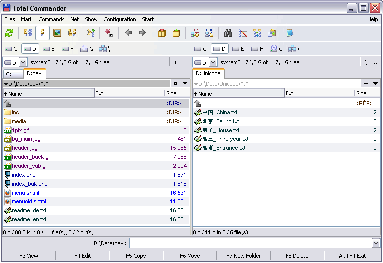
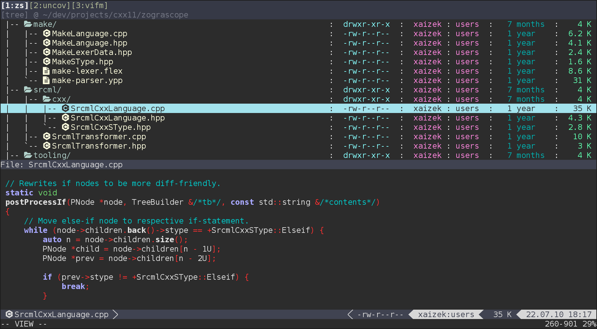
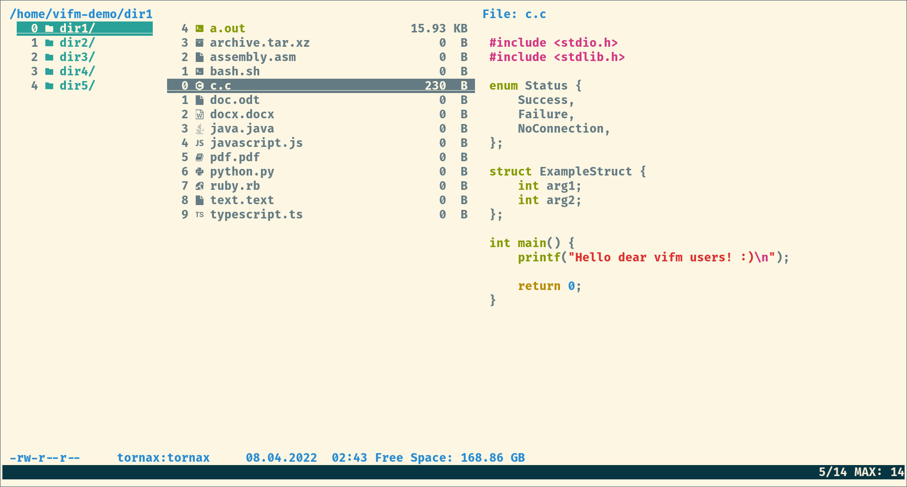
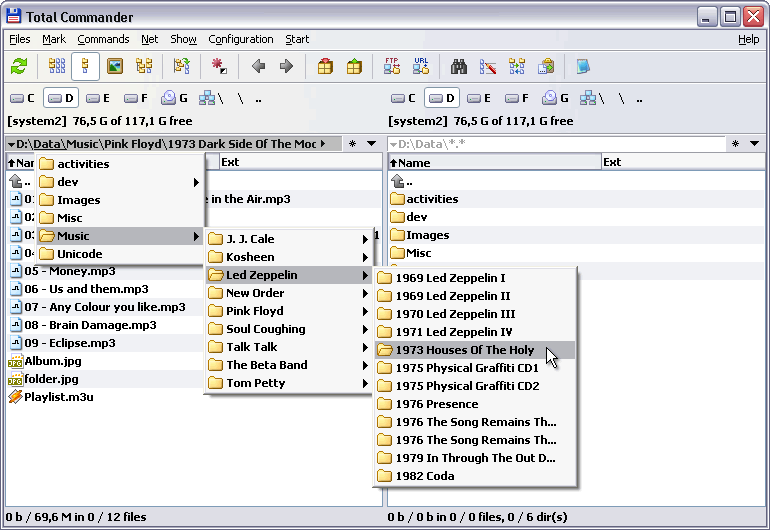
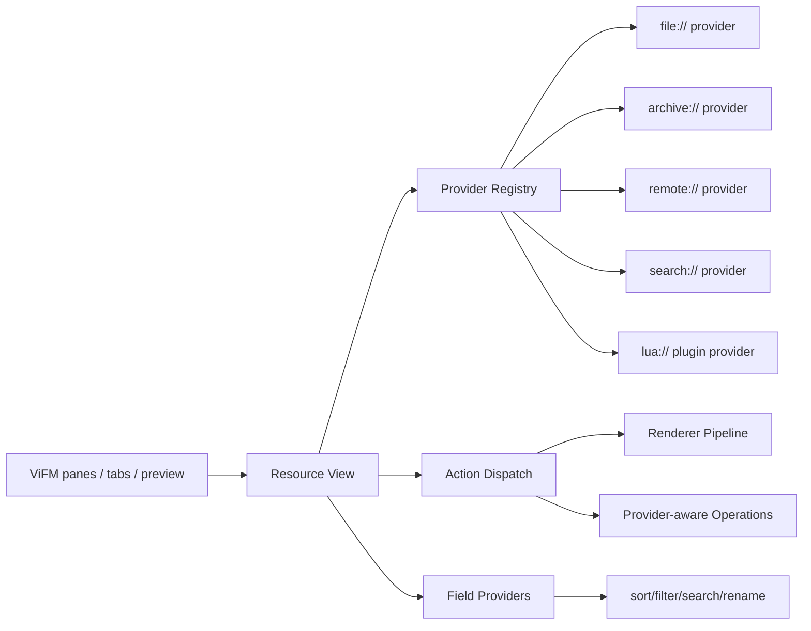

# Total Commander 与 ViFM 的底层哲学对齐调研

日期：2026-07-03  
目录：`research/total-commander-vifm/`  
素材索引：[`SOURCE_INDEX.md`](./SOURCE_INDEX.md)

## 结论先行

Total Commander 的强大不在于“功能多”，而在于它把文件管理抽象成一套极少数稳定语义：两个面板、源/目标、查看、编辑、复制、移动、删除、打包/解包、搜索、比较、同步、批量改名。这些动作不只服务普通目录，也服务压缩包、磁盘镜像、FTP、插件文件系统、内容字段和查看器。它的哲学接近 Unix：少数稳定动词，加上可替换的 provider，让新对象自动继承老动作。

ViFM 当前的强项是另一套哲学：Vim 式模式、命令行、寄存器、选区、宏、外部命令、custom view、Lua API。它的能力很 Unix，但抽象中心仍是“真实文件系统 + 外部命令绑定 + 命令输出列表”。如果目标是对齐甚至超越 Total Commander，ViFM 需要把“文件列表”升级为“资源视图”，把 archive、remote、search result、process output、metadata table、plugin filesystem 都纳入同一套 provider/verb/schema。

一句话路线：不要把 Total Commander 复刻成终端 GUI，而要把 TC 的“对象统一”嫁接到 ViFM 的“命令可组合性”上。

## 原始线索：知乎 “two window god”

我用以下关键词检索了公开网页：`"two window god" "Total Commander"`、`"双窗之神" "Total Commander"`、`"Total Commander" "Vim" "Emacs" "知乎"`、`"Total Commander" "文件管理之神"` 等。没有找到可核验的“two window god”原文，也未能定位到用户记忆中的知乎文章。知乎本身也经常存在登录墙和索引残缺，所以这里不把该线索当作事实来源。

最接近的硬证据有两类：

- Total Commander 作者 Christian Ghisler 的中文访谈：他明确说最初开发 TC，是因为 Windows 上找不到 DOS Norton Commander 那类“双窗口文件管理器”；他也把 TC 的长盛解释为“简单但强大”，用户可以从两目录复制开始，再逐渐学习热键、批量改名和插件。
- Orthodox File Manager 文章：把 Commander 家族归纳为“朴素界面下的极高功能密度”，核心是双对称面板、底部命令/终端、用户菜单/宏变量、键盘优先、可编程。

所以，“two window god”即便找不到原句，也可以被还原为一个更可靠的概念：双窗口不是布局偏好，而是 source/target 关系的常驻语法。

## 图像对照



Total Commander 官方截图说明它的主窗口由文件夹标签、双文件列表、命令行、底部功能键按钮组成，功能键按钮还能作为拖放目标。这个设计把“看见对象”“输入命令”“触发固定动词”放在一个平面上。



ViFM 的视觉重心是 curses 双栏与 Vim-like 控制环境。它天然适合键盘、命令、外部工具和远程终端，但缺少 TC 那种面向普通用户也稳定可见的动词栏。



ViFM 已经有多种 view 表现形态。真正的突破点不是再加一种视图，而是让每种视图后面挂同一套资源 provider 和动作语义。



TC 的路径栏不是装饰：它把当前位置、父级跳转和目录导航融合成可点击/可键盘触发的结构入口。这类“路径即交互对象”的细节，是 ViFM 做资源 URI 时也应该保留的设计方向。

## Total Commander 的核心抽象

### 1. 双栏不是 UI，是关系模型

TC 的两个窗口不是“同时看两个目录”这么简单，而是一直把一个 pane 设为 source，另一个 pane 设为 target。复制、移动、同步、比较、压缩/解压都默认拥有上下文。这降低了命令参数数量：用户不用每次声明源和目标，只要在两个 pane 中定位。

这与 ViFM 的双栏表面相似，但 TC 更强调固定动词围绕 source/target 运行；ViFM 更强调当前 view 中的命令、模式和选择。

### 2. “压缩”不是算法，是容器协议

TC 的 Packer plugins 并不只是添加压缩算法。官方说明中，Packer plugins 可以加入额外打包格式，也可以访问 CD-ROM image 或 list files 等特殊文件格式。这意味着“压缩包”在 TC 里更像一种 container provider：

- 可以列出内容；
- 可以进入；
- 可以查看/提取；
- 有些还可以创建、修改、删除条目；
- 对用户而言，它尽量像目录。

这就是用户提到的“把什么定义为压缩”的哲学级抽象：凡是能 list/extract/pack 的结构化容器，都可纳入 packer，而不是狭义 compressor。

### 3. “查看”不是打开文件，是渲染协议

Lister plugins 挂在 F3 这个稳定动词上。无论是源码高亮、PDF、SQLite、播放列表还是图片/音频信息，只要实现 Lister 协议，用户都用同一个“查看”动作进入。TC 把查看做成了内容渲染接口，而不是“调用某个外部程序”的配置项。

### 4. “内容”是字段，不是字符串展示

Content plugins 可以抽取 mp3 tag、照片曝光时间等字段；这些字段可显示在文件列表，也可用于搜索和批量改名。这里的抽象很关键：metadata 不是 preview 文本，而是可排序、可筛选、可搜索、可重命名模板引用的 typed field。

### 5. 插件分类就是架构边界

TC 官方插件生态分为四条主线：

| 插件类型 | 用户语义 | 架构意义 |
|---|---|---|
| Packer | 打包/进入/提取 | 容器 provider |
| File system | 网络邻居/远程/设备 | 虚拟文件系统 provider |
| Lister | F3 查看 | 渲染 provider |
| Content | 列、搜索、批量改名字段 | 元数据 provider |

TC 的简洁来自边界清晰：插件不是随意扩展 UI，而是补全资源、渲染、字段、容器这几类基础语义。

## ViFM 当前设计画像

### 1. ViFM 的自我定位

本地 README 明确说 ViFM 是 Vim-like file manager，不只是 keybinding，而是 modes、options、registers、commands 等 Vim 模型；同时强调 Unix philosophy：提供可定制手段，而不是固定方案。

源码结构也验证了这一点：`HACKING.md` 把 `engine/` 标为 Vim-like 核心，包含命令解析、补全、按键、模式、选项、变量；`modes/` 管各种交互模式；`int/` 管外部环境和 FUSE；`lua/` 提供插件 API；`ui/` 管 curses 视图。

### 2. 文件对象仍然偏 POSIX

`src/types.h` 的 `FileType` 是传统文件系统类型：link、dir、char device、block device、socket、exec、regular、fifo 等。也就是说，ViFM 的一等对象仍然是 OS 文件系统 entry；archive、remote、search result 等能力更多是通过 FUSE、custom view 或外部命令间接进入。

### 3. 打开/查看是 matcher 绑定，不是一等 provider

`src/filetype.h` 显示 ViFM 的关联模型是 matcher group -> associated programs/viewers。viewer 分 textual、graphical、pass-through。这个设计很灵活，也很 Unix，但核心是“文件匹配后调用命令”，不是“资源类型实现统一能力接口”。

官方文档中 `:filetype` 可以为 zip 配多个动作：FUSE mount、查看内容、就地解压；`:fileviewer` 捕获命令输出后显示在 pane。它能做很多事，但“zip 是一种 provider”并没有成为内核层的稳定对象模型。

### 4. Custom view 是关键支点

ViFM 已有非常强的中间形态：custom view。`src/filelist.h` 提供把路径列表装进 view 的 API；`src/running.h` 的 `rn_for_flist()` 可以运行命令并把输出解析成 custom view；`src/macros.h` 里 `%u/%U`、菜单输出、preview 输出、split 输出等宏让外部命令结果进入 UI。

这说明 ViFM 已经有“结果集即 view”的雏形。它的问题是结果集仍偏 path list，而不是 typed resource list。

### 5. Lua API 已经具备突破口

ViFM 官方 Lua 文档有 `vifm.addcolumntype()`、`vifm.addhandler()`、`vifm.currview()`、`vifm.otherview()`、events、fs、menus、tabs 等 API。它已经能加列、加 handler、读写 view、监听事件。要超越 TC，最现实的路线不是推倒 Lua，而是给 Lua/Rust/C provider 一个稳定资源协议。

## 关键差距表

| 维度 | Total Commander | ViFM 当前 | 差距 |
|---|---|---|---|
| 核心语法 | source/target 双栏 + 固定动词 | Vim mode/command + 双栏 view | ViFM 的双栏没有被提升为所有动作的默认关系模型 |
| 资源抽象 | archive、remote、image、list file 可像目录进入 | OS 文件系统为主，FUSE/custom view/外部命令补充 | 缺少统一 Resource Provider |
| 查看抽象 | Lister plugin 挂 F3，稳定渲染协议 | `:fileviewer` 调命令、捕获输出、Lua handler | 缺少 typed renderer pipeline 和能力协商 |
| 元数据抽象 | Content plugin 字段用于列、搜索、批量改名 | Lua custom columns，部分信息来自外部命令 | 字段未贯穿搜索/rename/sync/compare |
| 容器抽象 | Packer plugin 定义 list/extract/pack/modify | FUSE_MOUNT、外部解压、custom view | archive 不是一等可操作容器 |
| 操作模型 | 固定 F 键动词，学习成本低 | Vim 命令强，可组合但隐式 | 功能强但发现性弱 |
| 插件边界 | 四类插件边界清楚 | Lua API 通用但语义较散 | 插件缺少面向资源/字段/渲染/动作的契约 |
| 可超越点 | GUI/Windows 生态强 | 终端、远程、Unix 管道、Vim 语法强 | ViFM 可做 TC 做不到的组合式资源图 |

## 应该如何“颠覆”

### 第一原则：把 view 从 file list 升级成 resource list

现在 ViFM 的 view 可以显示目录，也可以显示 custom path list。下一层抽象应当是：



```c
typedef struct resource_t {
    resource_id_t id;
    resource_uri_t uri;
    resource_kind_t kind;
    field_map_t fields;
    capability_set_t caps;
} resource_t;

typedef struct resource_provider_t {
    int (*list)(resource_uri_t uri, resource_list_t *out);
    int (*stat)(resource_uri_t uri, field_map_t *out);
    int (*open)(resource_uri_t uri, open_intent_t intent);
    int (*preview)(resource_uri_t uri, preview_request_t req, preview_t *out);
    int (*copy)(resource_uri_t src, resource_uri_t dst, op_policy_t policy);
    int (*move)(resource_uri_t src, resource_uri_t dst, op_policy_t policy);
    int (*remove)(resource_uri_t uri, op_policy_t policy);
    int (*fields)(resource_uri_t uri, field_schema_t *out);
} resource_provider_t;
```

这不是要一次性重写整个 ViFM。第一步可以保留现有 `dir_entry_t`，在旁边加 resource adapter：

- `file://` provider 适配当前文件系统；
- `custom://` provider 适配当前 custom view；
- `archive://` provider 先读 zip/tar/7z，只做 list/extract；
- `fuse://` provider 包住现有 FUSE_MOUNT；
- `search://` provider 适配 find/grep/locate 结果；
- `lua://` provider 允许插件生成 typed resources。

### 第二原则：把“查看”拆成 intent + renderer

ViFM 现有 viewer 是命令输出。可以升级为 preview/open intent：

| Intent | 语义 |
|---|---|
| `peek` | 快速预览，不离开当前位置 |
| `view` | 只读查看，类似 TC F3 |
| `edit` | 可写编辑，类似 F4 |
| `inspect` | 展开结构化字段 |
| `enter` | 将资源作为 view 打开 |

Renderer 可按能力选择：text、ansi、sixel、kitty graphics、image metadata、table、tree、hex、json、archive listing。这样 PDF、SQLite、zip、EXIF、Git object 都能走同一个查看管线。

### 第三原则：把 Content plugin 变成 Field Provider

ViFM 已经有 Lua custom columns，但需要把字段升级为全局可用：

- 列显示：`viewcolumns`;
- 排序：`sort`;
- 过滤：`:filter`;
- 搜索：`:find` / `:grep` / 新 `:where`;
- 批量改名：模板字段；
- 同步/比较：字段参与比较；
- 状态栏/预览：字段可引用。

示例：

```vim
:fields add exif --provider lua:exif
:set viewcolumns=name,size,exif.Camera,exif.ExposureTime
:where exif.Camera =~ "Leica" && size > 5MB
:rename pattern="{exif.DateTimeOriginal}_{name}"
```

这才是与 TC Content plugins 对齐的关键。

### 第四原则：把 archive 当资源命名空间，而不是 FUSE 特例

需要定义 URI 语法：

```text
file:///Users/rex/a.zip
archive+zip:///Users/rex/a.zip!/dir/file.txt
search://ripgrep?root=/repo&q=ResourceProvider
remote+sftp://host/path
list://session/grep-2026-07-03
```

然后让动作继承：

- `l/Enter`：enter resource；
- `yy/dd/p` 或 copy/move：跨 provider copy；
- `:view`：走 renderer；
- `:compare`：provider 能力支持则结构比较，不支持则 fallback 到流；
- `:sync`：source/target 两 provider 间同步；
- `:rename`：对 provider 支持的字段批量修改。

### 第五原则：让 source/target 成为命令代数

ViFM 可保留 Vim 命令，但把 source/target 显式进入命令模型：

```vim
:copy %selection to %target
:sync %source %target --by content
:pack %selection into archive://%target/backup.zip
:mount %current as %target
:compare %left %right --fields name,size,hash
```

这比 TC 更强，因为它同时保留了面板默认值和可脚本化命令。

## 颠覆式路线图

### Phase 0：不破坏现有行为的抽象层

新增 `src/resource/`：

- `resource_uri.[ch]`：URI parse/format；
- `resource_provider.[ch]`：provider registry + capability；
- `resource_field.[ch]`：typed fields；
- `resource_view_adapter.[ch]`：把 resource list 映射到现有 `dir_entry_t` / custom view；
- `resource_action.[ch]`：copy/move/view/enter 的能力分派。

目标：所有现有目录仍走旧逻辑，但能通过 adapter 暴露为 `file://` resource。

### Phase 1：Archive provider

先支持 zip/tar/gz/xz/7z 的只读 list + extract。不要一开始追求完整 packer plugin SDK。完成后：

- `Enter a.zip` 进入 `archive+zip://...!/`;
- `:view a.zip` 显示结构化列表；
- 从 archive pane copy 到 file pane；
- 从 file pane copy 到 archive 先标记为 unsupported 或只支持 zip。

这是最能对齐 TC 的一刀。

### Phase 2：Field provider

把 Lua custom columns 变成字段 provider 的第一版：

- 字段 schema：name/type/cost/cacheability/provider；
- 字段缓存：按 content hash 或 mtime/size；
- 字段引用：columns、filter、rename、search；
- 内置字段：mime、hash、media、image、git。

### Phase 3：Renderer pipeline

整合 `:fileviewer`、Lua handler、previewprg：

- preview request 携带尺寸、颜色能力、图像协议；
- renderer 返回 text/table/tree/image/control；
- 旧 `fileviewer` 自动包成 renderer；
- 新 renderer 可以声明支持的 resource kind 和 mime。

### Phase 4：Provider-aware operations

重构 `ops_t` 上层，不急着替换底层 IO：

- `resource_copy(src, dst)` 决定 provider 间 strategy；
- file->file 仍走现有 `perform_operation()`;
- archive->file 调 extract；
- file->archive 调 add；
- remote->file 调 stream；
- unsupported 明确报能力错误。

### Phase 5：插件 SDK

保留 Lua，但定义更硬的语义边界：

- `vifm.providers.register()`;
- `vifm.fields.register()`;
- `vifm.renderers.register()`;
- `vifm.actions.register()`;
- 插件 manifest 声明能力、字段、资源 URI scheme；
- 可选 Rust/C ABI 用于高性能 provider。

## 能超越 TC 的方向

1. **组合式 provider**  
   TC 强在插件类别稳定，但组合不如 Unix。ViFM 可以让 `ripgrep -> custom resource list -> field extraction -> batch rename -> archive pack` 成为一条可复用命令。

2. **终端图形协议优先**  
   在 kitty/sixel/iTerm2 环境中，ViFM 可以做比 TC 更轻的跨平台预览：图片、PDF 页、视频帧、谱图、二维码都走 renderer pipeline。

3. **可审计操作队列**  
   TC 的文件操作很成熟。ViFM 可以进一步把所有跨 provider 操作记录成 transaction log：dry-run、resume、rollback、conflict policy、失败重试。

4. **资源图，而不是资源树**  
   TC 的模型仍主要是树。ViFM 可以把 tag、search、git history、recent、bookmarks、media album 做成 resource graph view，再用双 pane 操作图上的节点集。

5. **脚本化 UX 不牺牲可发现性**  
   增加一个 Commander-style command palette / action bar，显示当前 selection 在当前 provider 上可用的 verbs。底层仍是 Vim 命令，上层给用户可见入口。

## 最小可行实验

建议先做一个 spike，不动大面积代码：

1. 新增 `resource_uri` 和 `resource_provider` 最小接口。
2. 实现 `file_provider` 包装当前目录 list。
3. 实现 `zip_provider` 只读 list/extract，可先调用 `libarchive` 或外部 `bsdtar`。
4. 把 `archive://...` list 结果灌入现有 custom view。
5. 在 `rn_enter_dir()` 附近识别 zip 文件，进入 archive resource view。
6. 在 copy 操作中支持 archive resource -> real file。

验收标准：

- 对普通目录行为零回归；
- 在 ViFM 中按 Enter 进入 zip；
- zip 内条目能预览；
- zip 内文件能复制到另一个 pane；
- custom view 标题/状态栏能显示 resource URI；
- 不支持的写操作给出明确错误。

## 对当前代码的落点

| 现有位置 | 可承接的新职责 |
|---|---|
| `src/filelist.h` custom view API | 初期 resource list 的 UI 适配层 |
| `src/running.h` / `running.c` | 进入资源、运行外部 provider、把输出转 resource list |
| `src/macros.h` `%u/%U/%q/%m` | 把外部命令输出升级为 typed resources |
| `src/filetype.h` | 旧 filetype/fileviewer 兼容层，逐步映射到 renderer/action |
| `src/ops.h` | 上层改为 provider-aware operation dispatch |
| `src/lua/*` | 新 provider/field/renderer/action SDK |
| `src/int/fuse.c` | 作为 provider 后端之一，而不是 archive 唯一路径 |

## 风险

- **抽象过大**：如果一开始试图设计完整 VFS，会拖垮。必须从 archive read-only spike 开始。
- **性能**：字段 provider 容易慢，需要 cache、lazy load、cost 标记和异步 jobs。
- **一致性**：archive/remote/list/search 的 delete/rename/copy 语义不同，需要 capability 显示和明确错误。
- **UI 复杂度**：不要把 TC 的按钮栏原样搬进终端。应该用 action palette/status hint 暴露可用动词。
- **兼容性**：现有 `:filetype`、`:fileviewer`、FUSE_MOUNT、previewprg 必须作为兼容层保留。

## 参考资料

- Total Commander 官方 Addons/插件类别：https://www.ghisler.com/addons.htm
- Total Commander 官方插件列表：https://www.ghisler.com/plugins.htm
- Total Commander 官方截图 1：https://www.ghisler.com/screenshots/en/01.html
- Total Commander 官方截图 9：https://www.ghisler.com/screenshots/en/09.html
- Total Commander 作者访谈：https://www.thinkjam.org/zoptuno/archives/2007/02/interview-with-christian-ghisler.html
- Orthodox File Manager 深度文章：https://softpanorama.org/Articles/introduction_to_orthodox_file_managers.shtml
- 中文用户文章：软件推荐 Total Commander：https://networm.me/2022/01/09/total-commander/
- ViFM 官方文档入口：https://vifm.info/docs/
- ViFM app 文档：https://vifm.info/docs/v0.14.4/vifm-app.txt
- ViFM Lua 文档：https://vifm.info/docs/v0.14.4/vifm-lua.txt
- 本地 ViFM README：`README`
- 本地 ViFM 架构说明：`HACKING.md`
- 本地 ViFM 关键源码：`src/types.h`、`src/filetype.h`、`src/filelist.h`、`src/running.h`、`src/ops.h`、`src/macros.h`
